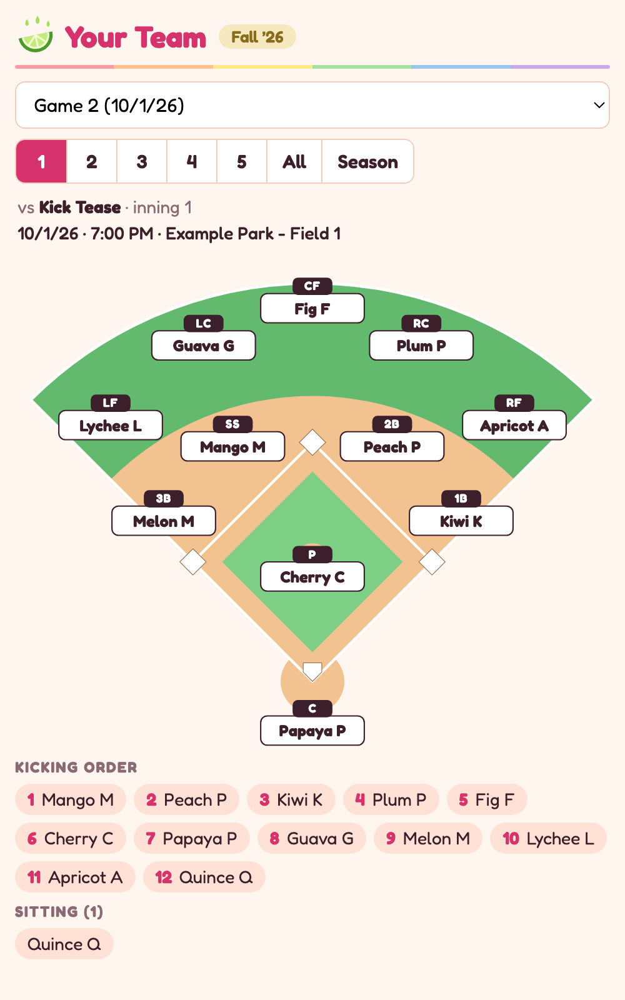
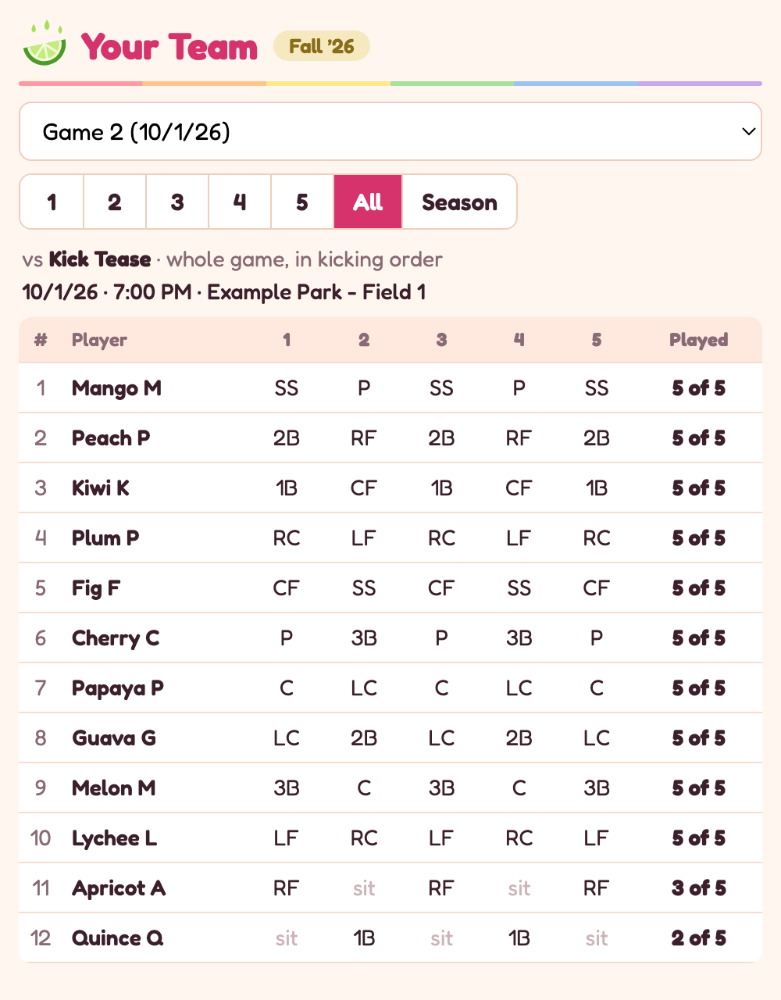
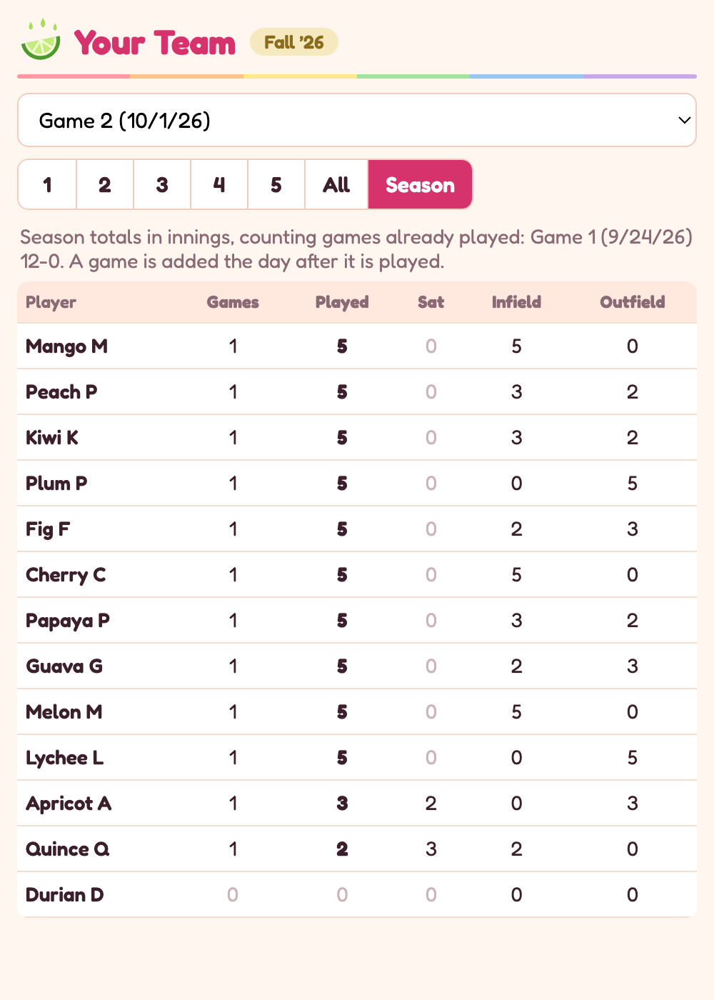

# Kickball Field View

A Google Apps Script add-on for a kickball lineup spreadsheet. It reads the lineup tabs and draws each inning's fielding on a diamond, with the kicking order, a whole-game table and season totals. It never edits the sheet.

Screenshots use made-up players.

| Field | Whole game | Season |
| --- | --- | --- |
|  |  |  |

## Features

- Pick a game and an inning to see who plays each of the 11 positions
- Open or double-booked positions are flagged in red, and so is an absent player who still has a position
- Game date, time, location, opponent and final score
- Kicking order and the players sitting each inning
- Whole-game table with innings played per player
- Season totals: innings played, sat, infield and outfield, across games already played
- Refreshes every 3 seconds while open, so edits in the sheet show up on their own
- Works as a pop-up inside the sheet or as a shareable web app link that gives no access to the spreadsheet

## How it works

`apps-script/Code.gs` runs on Google's side and reads the sheet:

1. It adds the **Kickball** menu and opens the pop-up, or serves the page as a web app.
2. It finds the current lineup tabs.
3. On each tab it finds the player grid: the rows between "Name" and "Acceptable", and the columns with an inning number in the header.
4. For each player it returns the name, the position in each inning, and whether the name is struck through.
5. For each tab it also returns the date, time, location, opponent, and whether the game date has passed.

`apps-script/Field.html` is the page:

1. It asks `Code.gs` for all lineups once when it opens. After that, switching games or innings happens in the browser.
2. The field is an SVG with eleven fixed spots. For the selected inning it puts each player's name on the spot matching their position code.
3. The whole-game and season tables are built from the same data.
4. Every 3 seconds, while the page is visible, it re-asks for the selected tab and redraws only if something changed.

The script writes to no cell. Deleting the two files from the Apps Script project removes the feature completely.

## Install

1. In the spreadsheet, open **Extensions > Apps Script**.
2. Replace the contents of `Code.gs` with [`apps-script/Code.gs`](apps-script/Code.gs).
3. Add an HTML file named `Field` and paste in [`apps-script/Field.html`](apps-script/Field.html).
4. In **Project Settings > Script Properties**, add `TEAM_NAME` and `SEASON_LABEL`. They are the heading and the tag beside it.
5. Save and reload the spreadsheet, then use **Kickball > Field view**.

## Sharing a link

1. In the Apps Script editor, choose **Deploy > New deployment > Web app**.
2. Set **Execute as** to Me.
3. Set **Who has access** to Anyone, or Anyone with a Google account.
4. Send the link ending in `/exec`.

A link-holder sees every current lineup tab, the kicking order and the season totals, and nothing else from the spreadsheet. After changing the code, publish a new version with **Deploy > Manage deployments > edit > New version**, or the link keeps serving the old code.

## What the sheet needs

| Convention | Used for |
| --- | --- |
| Tab name ends in "Lineup" | The tab is a game |
| Tab name starts with "OLD" | The tab is skipped |
| "Date:", "Time:", "Location:", "Opponent:", "Name" and "Acceptable" labels in column A | Finding the game details and the player grid. If one is missing, the view names the tab instead of guessing |
| Optional "Score:" label in column A, with the score in column B | Shown as the final score once filled in |
| Inning numbers in the "Name" row | One column per inning |
| Position codes P, C, 1B, 2B, 3B, SS, LF, LC, CF, RC, RF | Placing players on the field. Any other code is flagged |
| Strikethrough on a player's name | Player is not attending: left out of the kicking order, sitting list and totals |
| Row order of players | Kicking order |
| Game date before today | Game counts toward season totals |
| Same spelling of a name on every tab | Season totals add up as one person |

## Known limits

- The pop-up does not work in the Sheets phone app; the shared link does.
- A game counts toward season totals from the day after its date, whether or not it was actually played.
- Date and time appear exactly as the lineup tab displays them.
